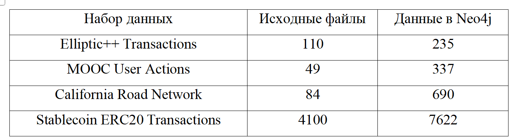
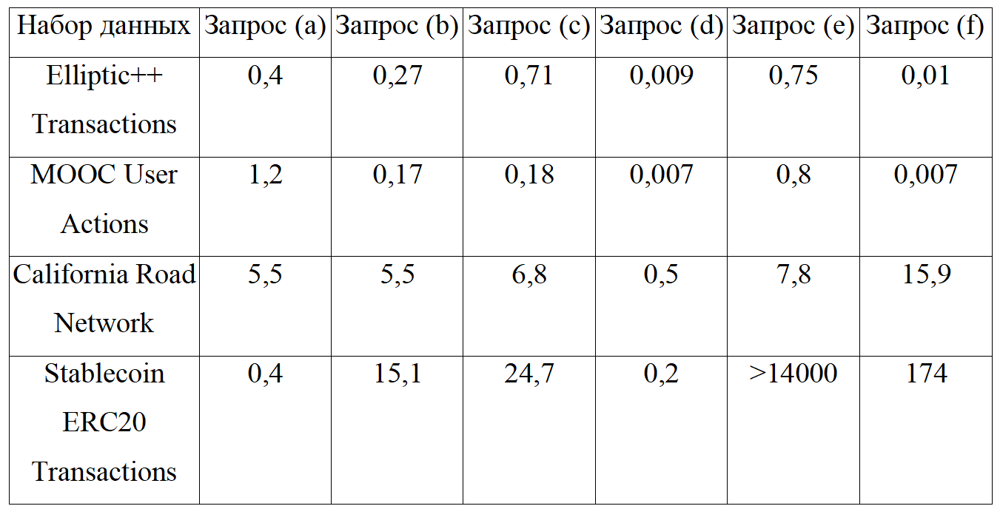
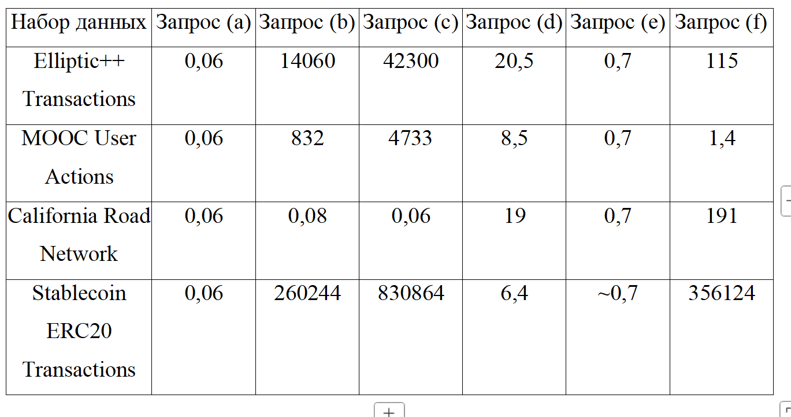

# Измерение производительности запросов к базе данных Neo4j

## Типы запросов

Для оценки производительности СУБД Neo4j выбраны следующие типы графовых запросов:

a) Выбор всех вершин с заданным значением поля;  
b) Выбор всех вершин с заданным значением поля с фильтром по связям (степень вершины с учётом условия на связи данной вершины);  
c) Подсчёт для каждой вершины суммы некоторого параметра по всем соседним вершинам с ограничением на связь/значение параметра (например, учитывать значение в сумме, если оно превышает некоторый порог);  
d) Нахождение кратчайшего пути между вершинами;  
e) Подсчёт всех «треугольников» в графе (без учёта ориентации);  
f) Рекурсивный обход графа с фильтрацией на пути.

## Тестовые наборы данных

Для тестирования выбраны наборы данных разной структуры с разным средним весом вершин, и разным количеством вершин и ребер. Это сделано для более объективной оценки последующего сравнения.

**Elliptic++**: [ссылка](https://github.com/git-disl/EllipticPlusPlus/tree/main/Transactions%20Dataset)

**Social Network: MOOC User Action Dataset**: [ссылка](https://snap.stanford.edu/data/act-mooc.html)

**California road network**: [ссылка](https://snap.stanford.edu/data/roadNet-CA.html)

**Stablecoin ERC20 Transactions Dataset**: [ссылка](https://snap.stanford.edu/data/ERC20-stablecoins.html)

## Установка и запуск

Скачивание образа базы данных Neo4j и запуск контейнера. Для надо запустить исполняемый файл:

```bash
./rundb.sh
```

Для запуска есть поддержка двух типов команд.

### Создание и удаление данных

```bash
npm start data <файл конфигурации> <действие с данными> <цель действия>
```

Файл конфигурации одно из:

1. ../configs/configElliptic.json
2. ../configs/configMooc.json
3. ../configs/configRoadNet.json
4. ../configs/configStableCoin.json

Действие с данными:

1. create
2. delete

Цель действия:

1. index
2. data
3. all

Данная команда выполняет выгрузку или удаление данных какого-либо набора. Также может выполнять создание и удаление индексов для наборов.

### Запросы

```bash
npm start query <файл конфигурации>
```

Файл конфигурации одно из:

1. ../configs/configElliptic.json
2. ../configs/configMooc.json
3. ../configs/configRoadNet.json
4. ../configs/configStableCoin.json

Данная команда выполняет все типы запросов для переданного набора данных и записывает в папки results и stats результаты выполнения и профилирование запросов соответственно

## Результаты

Дисковое пространство, занимаемое тестовыми наборами данных (МБ):


Время выполнения запросов (с):


Потребление оперативной памяти (КБ):

